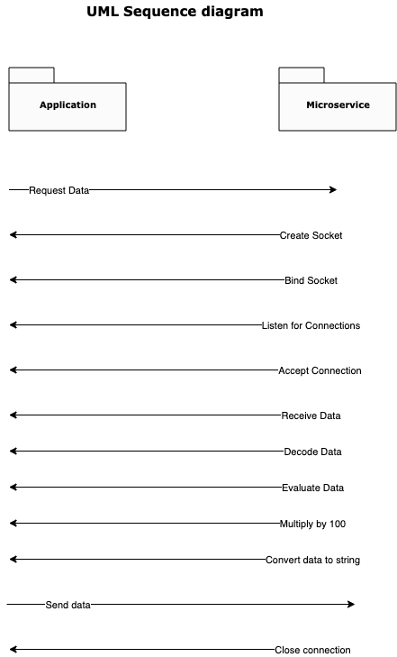

Customizable Quiz App with Score Calculating Microservice

This microservice performs a math operation by taking a list of numbers from the client and multiplying each number by 100. The result  is then sent back to the client. 

Installation 

Clone the repository to your computer.
Install Python 3.x.
Install the necessary dependencies using the following command: 

	pip install -r requirements.txt

Usage

Start the microservice by running the following command in your terminal: 

	python microservice.py

The microservice will start running on port 8005 of your local host. 
The client can connect to the microservice and send a list of numbers. The microservice will multiply each number by 100 and will send back the result to the client. 

Request and Response

The client should connect to the microservice using a TCP socket connection. The client can send a list of numbers to the microservice as a string, and the microservice will send a result back as a string. 

Request
The client should send a list of numbers as a string in the following format:
[1, 2, 3, 4]

Response
The microservice will send back the result as a string in the following format:
[100, 200, 300, 400]

